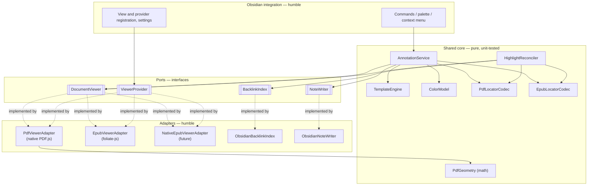
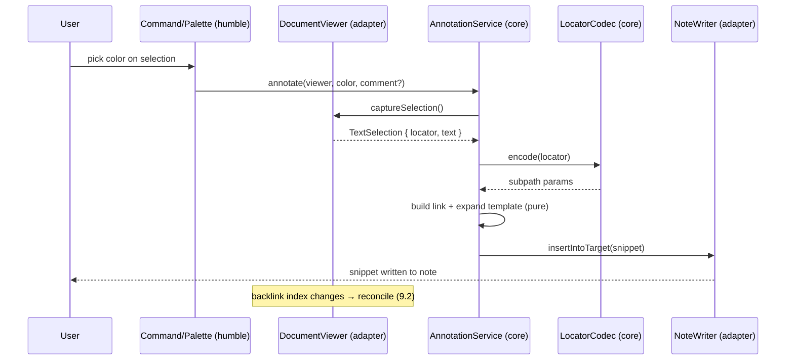
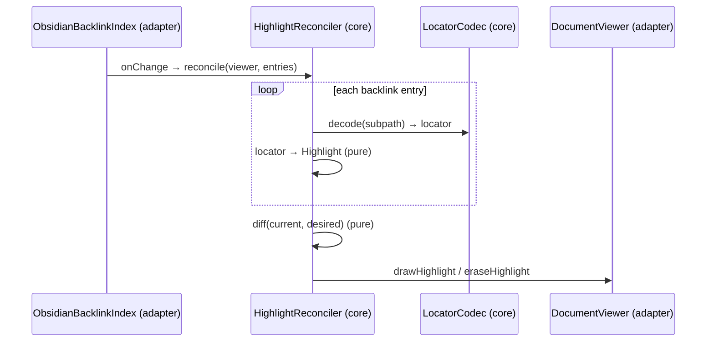

# Maki — Design

> Status: draft. This document describes **how** Maki is built. For **what** it does
> and the persisted link format, see [specification.md](./specification.md), whose
> terminology (document, backend, locator, highlight, annotation, backlink) is used
> here without redefinition.

## 1. Design goals

1. **One workflow, two backends.** PDF and EPUB share everything except what is
   irreducibly format-specific. Shared logic lives in one place.
2. **A document abstraction that survives a native EPUB viewer.** When Obsidian ships
   native EPUB support, swapping foliate-js for it must touch *one adapter*, not the
   core.
3. **Testable by construction (humble object pattern).** All framework-bound code
   (Obsidian, PDF.js, foliate-js, the DOM, the file system) is thin and logic-free;
   all real logic is pure and unit-tested.
4. **Markdown is the source of truth.** Highlights are a *projection* of links found in
   notes; geometry is *derived on demand*, never stored.

## 2. Architectural overview

Maki is structured as **ports and adapters** (hexagonal architecture) wrapped around a
**pure core**.



Three layers, with a strict dependency rule: **dependencies point inward.** The core
depends only on port interfaces and plain data; it never imports `obsidian`,
`pdfjs`, foliate, or touches the DOM.

| Layer | Knows about | Tested how |
| --- | --- | --- |
| **Core** | Plain data + port interfaces only | Pure unit tests, no mocks of frameworks |
| **Ports** | Nothing (just type signatures) | n/a |
| **Adapters / integration** | Obsidian, PDF.js, foliate-js, DOM, FS | Thin; integration / manual tests |

## 3. The document abstraction (ports)

The abstraction is a small set of interfaces. The core is written entirely against
these; each backend provides implementations. All types below are TypeScript
pseudocode.

### 3.1 Identifiers and references

```ts
type BackendId = 'pdf' | 'epub';               // extensible: 'epub-native', 'mobi', …

interface DocumentRef {
  path: string;                                 // vault-relative file path
  backend: BackendId;                           // chosen by extension / sniffing
}
```

### 3.2 Locator — the abstract address

A `Locator` is a backend-tagged, serializable address of a point or range in a
document. It is the single concept that the entire core manipulates; backends define
their own payload shapes.

```ts
type Locator = PdfLocator | EpubLocator;

interface PdfLocator {
  backend: 'pdf';
  page: number;                                 // 1-based
  target:
    | { kind: 'text'; begin: [item: number, offset: number];
                       end:   [item: number, offset: number] }
    | { kind: 'rect'; rect: [l: number, b: number, r: number, t: number] }
    | { kind: 'annotation'; id: string };
}

interface EpubLocator {
  backend: 'epub';
  cfi: string;                                  // CFI body, *unwrapped*, *decoded*
}
```

> The on-disk encoding of a locator (the link subpath) is defined in
> [specification.md](./specification.md) §6. Conversion between `Locator` and subpath
> is the job of `LocatorCodec` (§4.1) — a pure function, hence easy to test against the
> contract.

### 3.3 Selection and highlight — abstract data

```ts
interface TextSelection {
  locator: Locator;                             // where it is
  text: string;                                 // the selected plain text
}

type HighlightId = string;                      // stable id derived from the locator

interface Highlight {
  id: HighlightId;
  locator: Locator;
  color: Color;
  sources: NoteRef[];                           // notes whose backlinks created it
}

interface Color { name?: string; rgb: [number, number, number]; }
interface NoteRef { path: string; line?: number; }
```

### 3.4 `DocumentViewer` — the rendering & interaction port

One open document = one `DocumentViewer`. This is the heart of the abstraction: it is
all the core needs in order to drive *any* backend.

```ts
interface DocumentViewer {
  readonly backend: BackendId;
  readonly ref: DocumentRef;

  /** Navigate to a locator and briefly flash it (FR-6.1). */
  reveal(target: Locator, opts?: { flash?: boolean }): Promise<void>;

  /** The current live user selection, as an abstract selection, or null. */
  captureSelection(): TextSelection | null;
  /** Fires whenever the live selection changes (for auto-copy, palette state). */
  onSelectionChange(cb: (sel: TextSelection | null) => void): Disposable;

  /** Draw / erase highlights (FR-5.2, FR-5.3). Idempotent by id. */
  drawHighlight(h: Highlight): void;
  eraseHighlight(id: HighlightId): void;
  clearHighlights(): void;
  /** Fires when the user clicks a drawn highlight (FR-6.2). */
  onHighlightActivate(cb: (id: HighlightId) => void): Disposable;

  metadata(): DocumentMetadata;                 // title, page/section labels, …
  destroy(): void;
}
```

What is deliberately **not** in this interface: pages, iframes, CFIs, PDF.js objects,
DOM nodes. Those leak only into the adapters.

### 3.5 `ViewerProvider` — the acquisition port

Backends differ most in *how a viewer comes to exist*: the PDF backend **patches an
existing Obsidian view**, while the EPUB backend **registers and mounts its own view**.
This difference is hidden behind `ViewerProvider`.

```ts
interface ViewerProvider {
  readonly backend: BackendId;
  canHandle(ref: DocumentRef): boolean;
  /** Register Obsidian views / patches at plugin load. */
  setup(ctx: PluginContext): Disposable;
  /** Yield a DocumentViewer for an open instance of the document. */
  acquire(host: ViewerHost, ref: DocumentRef): Promise<DocumentViewer>;
}
```

A `ViewerRegistry` (core) maps `DocumentRef` → `ViewerProvider`. Adding a backend =
registering one provider.

### 3.6 `LocatorCodec`, `BacklinkIndex`, `NoteWriter` — supporting ports

```ts
interface LocatorCodec {                        // pure; one per backend
  readonly backend: BackendId;
  encode(loc: Locator): SubpathParams;          // → {page, selection, …} | {epubcfi}
  decode(params: SubpathParams): Locator | null;
}

interface BacklinkIndex {                        // over Obsidian's metadata cache
  forDocument(ref: DocumentRef): BacklinkEntry[];
  onChange(ref: DocumentRef, cb: () => void): Disposable;
}
interface BacklinkEntry { subpath: SubpathParams; color?: string; source: NoteRef; }

interface NoteWriter {                           // over vault / editor
  insertIntoTarget(text: string, target: TargetStrategy): Promise<void>;
  copyToClipboard(text: string): Promise<void>;
}
```

## 4. The shared core (pure, unit-tested)

Everything in this section is framework-free and depends only on the ports and plain
data. This is where Maki's behavior actually lives — and where "common implementation
for both backends" is realized.

### 4.1 Locator codecs

Two pure implementations of `LocatorCodec` — `PdfLocatorCodec` and `EpubLocatorCodec`
— translate between `Locator` and the subpath `key=value` map defined in
[specification.md](./specification.md) §6, including the EPUB CFI percent-encoding.
Being pure string/struct transforms, they are tested directly against the spec's
examples (round-trip: `decode(encode(x)) === x`, and fixed golden strings).

### 4.2 `TemplateEngine`

Pure template expansion: `(template, variables) → string`. Used for both the snippet
and the link display text (spec §6.6). No I/O, no DOM. Variables are supplied by the
caller, so tests pass plain objects.

### 4.3 `ColorModel`

Pure mapping between palette names and RGB, and parsing/serialization of the `color`
subpath value (`name` or `r,g,b`).

### 4.4 `AnnotationService` — create an annotation

Orchestrates FR-3/FR-4 using only ports:

```ts
class AnnotationService {
  constructor(
    private codecs: Record<BackendId, LocatorCodec>,
    private templates: TemplateEngine,
    private colors: ColorModel,
    private notes: NoteWriter,
  ) {}

  async annotate(viewer: DocumentViewer, color: Color, comment?: string) {
    const sel = viewer.captureSelection();      // ← humble adapter does the DOM work
    if (!sel) return;
    const subpath = this.codecs[sel.locator.backend].encode(sel.locator);
    const link = buildLink(viewer.ref, subpath, color, /* display */ …);
    const snippet = this.templates.expand(snippetTemplate, {
      link, text: sel.text, comment, color, …
    });
    await this.notes.insertIntoTarget(snippet, targetStrategy);   // FR-4.2
  }
}
```

The only non-pure things it calls are `viewer.captureSelection()` and `notes.*`, both
ports — so in tests they are trivial fakes. The construction of the locator, link, and
snippet (the actual logic) is pure.

### 4.5 `HighlightReconciler` — render notes as highlights

Implements FR-5: keep the viewer's highlights in sync with the notes. This is the most
valuable piece to keep pure, and it is **identical for both backends** — the only
backend-specific step (decode subpath → locator) is delegated to the codec.

```ts
class HighlightReconciler {
  reconcile(viewer: DocumentViewer, entries: BacklinkEntry[]) {
    const desired = new Map<HighlightId, Highlight>();
    for (const e of entries) {
      const loc = this.codecs[viewer.backend].decode(e.subpath);
      if (!loc) continue;                        // ignore links without a location
      const h = toHighlight(loc, e);             // pure: id, color, merge sources
      mergeInto(desired, h);                     // same id ⇒ merge note sources
    }
    diff(this.current, desired)                  // pure set diff
      .added.forEach(h => viewer.drawHighlight(h))
      .removed.forEach(id => viewer.eraseHighlight(id));
    this.current = desired;
  }
}
```

The wiring (`BacklinkIndex.onChange → reconcile`) lives in the integration layer; the
diffing, id derivation, color resolution, and source merging are pure and exhaustively
unit-tested (add / remove / recolor / duplicate-target / malformed-subpath cases).

### 4.6 `PdfGeometry` — PDF highlight math (pure part)

Computing the rectangles for a PDF text range is **pure math** given the page's text
item boxes: `(textItems, begin, end) → MergedRect[]`. This lives in the core and is
unit-tested with fixture text layers. Only *acquiring* the text item boxes and
*injecting* the resulting rectangles into the DOM are humble (in the PDF adapter,
§5). EPUB needs no equivalent: foliate's overlayer derives geometry from a DOM range
itself (§6).

## 5. PDF backend (adapter — humble)

Goal: reuse Obsidian's built-in PDF viewer, exactly as obsidian-pdf-plus does, rather
than render PDFs ourselves.

### 5.1 Strategy: patch the native viewer

Obsidian's PDF view is a private class stack over PDF.js:

```
PDFView → PDFViewerComponent (viewer) → PDFViewerChild (child)
        → ObsidianViewer (pdfViewer) → pdfjsViewer.PDFViewer
```

`PdfViewerProvider.setup()` installs `monkey-around` patches on these prototypes
(lazily, retrying on `layout-change` until the classes exist, since they are created
only when a PDF is first opened). `acquire()` wraps a live `PDFViewerChild` in a
`PdfViewerAdapter`.

### 5.2 What the adapter implements

| `DocumentViewer` member | How (humble) |
| --- | --- |
| `captureSelection()` | Read the DOM `Selection`; map start/end to `(textItemIndex, charOffset)` per page → `PdfLocator`. |
| `reveal(loc)` | Translate the locator into a PDF.js destination and scroll; flash via the native highlight method. |
| `drawHighlight(h)` | Ask `PdfGeometry` (pure) for rects, then inject absolutely-positioned `<div>`s into a per-page overlay layer. |
| `onHighlightActivate` | Click handler on the injected overlay elements. |
| `onSelectionChange` | `pointerup` / `selectionchange` listeners on the viewer container. |

The adapter contains **no annotation logic** — it only converts between Obsidian/PDF.js
reality and the abstract types. All decisions are made by the core.

### 5.3 Optional: embed annotations into the PDF (FR-10)

A separate, opt-in `PdfAnnotationWriter` writes real PDF text-markup annotations via
`pdf-lib`, behind a small `PdfFileIO` interface (mockable). This mirrors
obsidian-pdf-plus's existing `IPdfIo` seam and keeps the only file-mutating code
isolated and replaceable. Default mode never touches the file.

## 6. EPUB backend (adapter — humble)

Goal: render EPUB and resolve positions with foliate-js, from the preview, behind the
same `DocumentViewer` port.

### 6.1 Strategy: host `<foliate-view>` in a plugin-owned view

Because Obsidian has no native EPUB view, `EpubViewerProvider.setup()` registers a
custom `ItemView` (view type `maki-epub`) and associates it with the `.epub` extension.
`acquire()` mounts a foliate `<foliate-view>` element in that view and wraps it in an
`EpubViewerAdapter`.

A vault-backed loader feeds foliate's EPUB parser:

```ts
// foliate's EPUB parser wants href-keyed accessors:
new EPUB({ loadText, loadBlob, getSize, sha1 }).init()
```

Maki supplies `loadText` / `loadBlob` / `getSize` over the EPUB (read via Obsidian's
file API, unzipped with foliate's bundled zip reader), so books load straight from the
vault.

### 6.2 What the adapter implements

| `DocumentViewer` member | How (humble) |
| --- | --- |
| `captureSelection()` | foliate emits no selection event, so on each section `load` the adapter attaches a `pointerup` listener to the section document, reads the `Selection`, and calls `view.getCFI(index, range)` to mint a CFI → `EpubLocator`. |
| `reveal(loc)` | `view.goTo(cfi)` (then a transient highlight). |
| `drawHighlight(h)` | `view.addAnnotation({ value: cfi, color })`; the `draw-annotation` handler calls `Overlayer.highlight`. foliate computes the geometry from the resolved range — no math on our side. |
| `eraseHighlight(id)` | `view.deleteAnnotation({ value: cfi })`. |
| `onHighlightActivate` | foliate's `show-annotation` event (click hit-test on the overlay). |
| Re-apply on relayout | foliate's `create-overlay` event (re-draw a section's highlights when it (re)loads). |
| `metadata()` | foliate `book.metadata`, TOC labels, `relocate` progress. |

### 6.3 Constraints the adapter must honor

- **Security / CSP.** EPUB sections are arbitrary HTML rendered in `<iframe>`s; Maki
  applies a strict CSP that blocks scripts. Book scripts never run (spec §8).
- **Never inject DOM into section bodies.** foliate's CFI round-tripping assumes the
  content DOM is untouched; highlights are drawn in foliate's separate SVG overlayer,
  not in the text flow. Styling is injected only via `renderer.setStyles` and
  `::part(filter)` (for theme follow).
- **Vendored, pinned.** foliate-js has no npm release and is not API-stable; it is
  vendored at a pinned revision (MIT, dependency-free) and bundled.

## 7. Future backend: native Obsidian EPUB

When Obsidian ships a native EPUB viewer, add a `NativeEpubViewerProvider` +
`NativeEpubViewerAdapter` that **patch** that native view (the PDF strategy, §5)
instead of hosting foliate. Crucially:

- The `DocumentViewer` and `ViewerProvider` ports are unchanged.
- `EpubLocator` stays CFI-based (the native viewer is also expected to speak CFI; if it
  uses a different address, only `EpubLocatorCodec` + the adapter change, and a
  one-time link migration can be provided).
- The core (`AnnotationService`, `HighlightReconciler`, templates, colors) is untouched.

See §12 for the concrete migration steps.

## 8. Obsidian integration layer (humble)

A thin layer that registers everything and wires ports to core:

- **Commands / palette / context menu** (FR-9): translate user intent into calls on
  `AnnotationService`, using the active `DocumentViewer`.
- **`ObsidianBacklinkIndex`** (`BacklinkIndex`): reads the metadata cache for refs to
  the open document, parses subpaths into `SubpathParams`, emits `onChange` on cache
  updates → drives `HighlightReconciler`.
- **`ObsidianNoteWriter`** (`NoteWriter`): clipboard + auto-paste into the target note
  (editor when open, else `vault.process`), with the configurable target strategy
  (FR-8.3).
- **Settings tab**: palette, templates, auto-paste, EPUB rendering prefs (FR-8).
- **Hover / backlink navigation** (FR-6): register hover-link sources and handle clicks
  on annotation links → `viewer.reveal`.

None of these make annotation decisions; they only adapt Obsidian to the ports.

## 9. Key data flows

### 9.1 Create an annotation (FR-3/FR-4)



### 9.2 Render notes as highlights (FR-5)



### 9.3 Navigate from a link (FR-6.1)

```
click backlink → integration resolves DocumentRef + subpath
              → LocatorCodec.decode (core)
              → ViewerRegistry.acquire (open if needed)
              → DocumentViewer.reveal(locator, { flash: true })
```

## 10. Humble object pattern — the testability map

The rule: **every framework boundary is a thin adapter; the logic behind it is pure.**

| Concern | Humble object (no logic, not unit-tested) | Pure core (unit-tested) |
| --- | --- | --- |
| Create annotation | `captureSelection`, `NoteWriter` | `AnnotationService`, link build, template |
| Render highlights | `drawHighlight` / `eraseHighlight`, `BacklinkIndex` | `HighlightReconciler` (decode, id, diff, merge) |
| Link format | — | `LocatorCodec` (encode/decode, CFI encoding) |
| PDF geometry | acquire text boxes, inject `<div>`s | `PdfGeometry` (rects, merging) |
| EPUB geometry | foliate overlayer | (none needed) |
| Colors / templates | — | `ColorModel`, `TemplateEngine` |
| Viewer acquisition | `ViewerProvider.setup/acquire`, patches | `ViewerRegistry` (selection by ref) |
| Navigation | `reveal` (scroll), click handlers | locator decode, target resolution |
| PDF file embed (opt.) | `PdfFileIO` (pdf-lib) | annotation-dict assembly inputs |

If a piece is hard to unit-test, it belongs in the left column and must be trivial; if
it contains a decision, it belongs in the right column.

## 11. Testing strategy

- **Unit (the bulk).** Core modules with no mocks of frameworks — only plain data and
  fake ports:
  - `LocatorCodec`: round-trip + golden strings against spec §6 (both backends; CFI
    percent-encoding edge cases).
  - `HighlightReconciler`: add / remove / recolor / duplicate-target / malformed
    subpath; verifies exact `draw`/`erase` calls on a fake `DocumentViewer`.
  - `AnnotationService`: selection → snippet, with fake viewer/codec/writer.
  - `TemplateEngine`, `ColorModel`, `PdfGeometry`: pure I/O tables and fixtures.
- **Contract tests for ports.** A shared suite any `DocumentViewer` /
  `LocatorCodec` implementation must pass, so PDF, EPUB, and future native-EPUB
  adapters are held to the same behavior.
- **Integration / manual.** Adapter behavior against real Obsidian / PDF.js /
  foliate-js (selection capture, reveal, overlay rendering) — necessarily thin, since
  the adapters carry no logic.

Test stack: the project uses Node 22 + pnpm + TypeScript + esbuild; a fast unit runner
(e.g. Vitest) over the `core/` modules. The core has no DOM/Obsidian imports, so it
runs without a browser environment.

## 12. Migration plan: foliate → native EPUB

When Obsidian ships a native EPUB viewer:

1. Implement `NativeEpubViewerProvider` (patch the native view) and
   `NativeEpubViewerAdapter` (implement `DocumentViewer`).
2. Register it for `backend: 'epub'` (or a new `'epub-native'`); the `ViewerRegistry`
   selects it instead of foliate. Optionally keep foliate as a fallback.
3. If the native viewer's addressing differs from CFI, adjust only `EpubLocatorCodec`
   and provide a one-time migration over existing `epubcfi=` links. If it is CFI, no
   link changes are needed.
4. Delete the vendored foliate-js and the `maki-epub` `ItemView` once the native path
   is proven.

Unchanged in all cases: `AnnotationService`, `HighlightReconciler`, `TemplateEngine`,
`ColorModel`, the link format, and every note already written.

## 13. Module layout (proposed)

```
src/
  core/                     # pure, framework-free, unit-tested
    locator/                #   PdfLocatorCodec, EpubLocatorCodec, types
    annotate/               #   AnnotationService
    highlight/              #   HighlightReconciler
    pdf-geometry/           #   PdfGeometry (math)
    template/               #   TemplateEngine
    color/                  #   ColorModel
    registry.ts             #   ViewerRegistry
  ports/                    # interface-only: DocumentViewer, ViewerProvider,
                            #   LocatorCodec, BacklinkIndex, NoteWriter
  backends/
    pdf/                    # PdfViewerProvider/Adapter, patches, PdfFileIO (opt.)
    epub/                   # EpubViewerProvider/Adapter, foliate host, vault loader
    epub-native/            # (future)
  obsidian/                 # commands, settings, ObsidianBacklinkIndex/NoteWriter
  vendor/foliate-js/        # pinned, MIT
  main.ts                   # plugin entry: construct core, register providers
```

## 14. Risks and open questions

- **Obsidian PDF internals are private** and change between versions; patches need
  version guards and graceful degradation (a real source of churn in
  obsidian-pdf-plus).
- **Locator drift.** PDF text-item indices can shift with PDF.js segmentation changes;
  CFIs can drift if the EPUB file itself changes. Mitigation: store the selected text
  alongside the locator and re-anchor by text match when resolution fails (open: how
  aggressively to re-anchor).
- **foliate-js instability.** Pinned vendoring; a thin adapter limits blast radius.
- **EPUB security.** Strict CSP is mandatory; revisit if Obsidian/Electron defaults
  change.
- **Open:** exact target-selection strategy for auto-paste; whether to offer a
  dedicated annotations panel; whether `epub-native` should reuse `backend: 'epub'` or
  be distinct.
