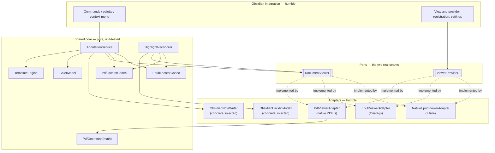
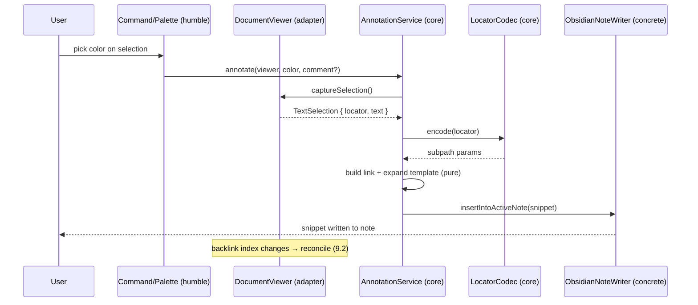
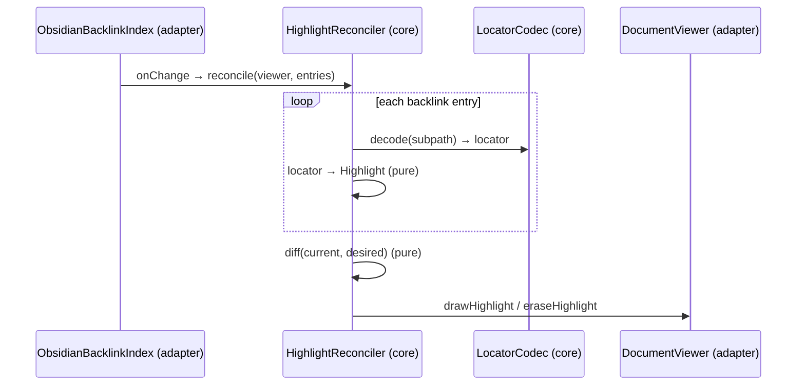

# Maki — Design

> Status: draft. This document describes **how** Maki is built. For **what** it does
> and the persisted link format, see [specification.md](./specification.md), whose
> terminology (document, backend, locator, highlight, annotation, backlink) is used
> here without redefinition.

## 1. Design goals

1. **One workflow, two backends.** PDF and EPUB share everything except what is
   irreducibly format-specific. Shared logic lives in one place.
2. **A document abstraction that survives a native EPUB viewer.** When Obsidian ships
   native EPUB support, swapping foliate-js for it must touch *one adapter*, not the
   core.
3. **Testable by construction (humble object pattern).** All framework-bound code
   (Obsidian, PDF.js, foliate-js, the DOM, the file system) is thin and logic-free;
   all real logic is pure and unit-tested.
4. **Markdown is the source of truth.** Highlights are a *projection* of links found in
   notes; geometry is *derived on demand*, never stored.

## 2. Architectural overview

Maki is structured as **ports and adapters** (hexagonal architecture) wrapped around a
**pure core**.



Three layers, with a strict dependency rule: **dependencies point inward.** The core
depends only on plain data, the two viewer-port interfaces, and structural types for
whatever else it is handed; it never imports `obsidian`, `pdfjs`, foliate, or touches
the DOM.

> **Ports are asymmetric — by design, not by oversight.** Only two seams carry genuine
> polymorphism: `DocumentViewer` and `ViewerProvider`, each with *three* real
> implementations (PDF, EPUB, future native-EPUB). These earn named `interface`s. The
> other framework boundaries (`BacklinkIndex`, `NoteWriter`) have exactly **one**
> implementation forever — Obsidian's vault/metadata-cache is the only place to read
> backlinks or write notes — so they are **concrete classes injected into the core**,
> not ports. The core stays testable not because they are interfaces but because they
> are *injected*: TypeScript's structural typing lets a test pass a plain fake with the
> right shape. Testability is bought with dependency injection, not with interface
> declarations. (`LocatorCodec` is a third case — two implementations, but it wants
> dispatch, not a contract; see §4.1.)

| Layer | Knows about | Tested how |
| --- | --- | --- |
| **Core** | Plain data + the two viewer-port interfaces + injected concretes (by structural type) | Pure unit tests, no mocks of frameworks |
| **Ports** | Nothing (just type signatures) | n/a |
| **Adapters / integration** | Obsidian, PDF.js, foliate-js, DOM, FS | Thin; integration / manual tests |

## 3. The document abstraction (ports)

The abstraction is a small set of interfaces. The core is written entirely against
these; each backend provides implementations. All types below are TypeScript
pseudocode.

### 3.1 Identifiers and references

```ts
type BackendId = 'pdf' | 'epub';               // extensible: 'epub-native', 'mobi', …

interface DocumentRef {
  path: string;                                 // vault-relative file path
  backend: BackendId;                           // chosen by extension / sniffing
}
```

### 3.2 Locator — the abstract address

A `Locator` is a backend-tagged, serializable address of a point or range in a
document. It is the single concept that the entire core manipulates; backends define
their own payload shapes.

```ts
type Locator = PdfLocator | EpubLocator;

interface PdfLocator {
  backend: 'pdf';
  page: number;                                 // 1-based
  target:
    | { kind: 'text'; begin: [item: number, offset: number];
                       end:   [item: number, offset: number] }
    | { kind: 'rect'; rect: [l: number, b: number, r: number, t: number] }
    | { kind: 'annotation'; id: string };
}

interface EpubLocator {
  backend: 'epub';
  cfi: string;                                  // CFI body, *unwrapped*, *decoded*
}
```

> The on-disk encoding of a locator (the link subpath) is defined in
> [specification.md](./specification.md) §6. Conversion between `Locator` and subpath
> is the job of `LocatorCodec` (§4.1) — a pure function, hence easy to test against the
> contract.

### 3.3 Selection and highlight — abstract data

```ts
interface TextSelection {
  locator: Locator;                             // where it is
  text: string;                                 // the selected plain text
}

type HighlightId = string;                      // stable id derived from the locator

interface Highlight {
  id: HighlightId;
  locator: Locator;
  color: Color;
  sources: NoteRef[];                           // notes whose backlinks created it
}

interface Color { name?: string; rgb: [number, number, number]; }
interface NoteRef { path: string; line?: number; }
```

### 3.4 `DocumentViewer` — the rendering & interaction port

One open document = one `DocumentViewer`. This is the heart of the abstraction: it is
all the core needs in order to drive *any* backend.

```ts
interface DocumentViewer {
  readonly backend: BackendId;
  readonly ref: DocumentRef;

  /** Navigate to a locator and briefly flash it (FR-6.1). Resolves with how
   *  precisely the target was reached — 'fallback' means the exact passage no
   *  longer resolves and the nearest coarse position (page / section) was used —
   *  so the integration layer can notify the user (FR-6.4) without the adapter
   *  making that decision. */
  reveal(target: Locator, opts?: { flash?: boolean }): Promise<RevealOutcome>;
  // type RevealOutcome = 'exact' | 'fallback' | 'not-found'  (owned by this file)

  /** The current user selection, as an abstract selection, or null. Must
   *  survive the DOM selection being taken over by another pane (focusing
   *  the note to paste into): it stays current until the user clears it
   *  inside the viewer or replaces it. */
  captureSelection(): TextSelection | null;
  /** Fires whenever the live selection changes (for annotate-on-selection, palette state). */
  onSelectionChange(cb: (sel: TextSelection | null) => void): Disposable;
  /** Fires when a pointer press adjusting the selection starts/releases —
   *  a raw fact; annotate-on-selection holds fire while `true`. */
  onSelectionDrag(cb: (dragging: boolean) => void): Disposable;

  /** Draw / erase highlights (FR-5.2, FR-5.3). Idempotent by id. */
  drawHighlight(h: Highlight): void;
  eraseHighlight(id: HighlightId): void;
  clearHighlights(): void;
  /** Fires when the user clicks a drawn highlight (FR-6.2). */
  onHighlightActivate(cb: (id: HighlightId) => void): Disposable;

  metadata(): DocumentMetadata;                 // title, page/section labels, …
  destroy(): void;
}
```

What is deliberately **not** in this interface: pages, iframes, CFIs, PDF.js objects,
DOM nodes. Those leak only into the adapters.

### 3.5 `ViewerProvider` — the acquisition port

Backends differ most in *how a viewer comes to exist*: the PDF backend **patches an
existing Obsidian view**, while the EPUB backend **registers and mounts its own view**.
This difference is hidden behind `ViewerProvider`.

```ts
interface ViewerProvider {
  readonly backend: BackendId;
  canHandle(ref: DocumentRef): boolean;
  /** Register Obsidian views / patches at plugin load. */
  setup(ctx: PluginContext): Disposable;
  /** Yield a DocumentViewer for an open instance of the document. */
  acquire(host: ViewerHost, ref: DocumentRef): Promise<DocumentViewer>;
}
```

A `ViewerRegistry` (core) maps `DocumentRef` → `ViewerProvider`. Adding a backend =
registering one provider.

### 3.6 Supporting collaborators — not ports

The pieces below are framework boundaries too, but they are **not** ports. None has
more than one realistic implementation, so none earns an `interface` in a dedicated
ports layer. They are plain structural types: the core receives them by injection and
tests pass fakes of the same shape.

**`LocatorCodec` — a dispatch type, not a port.** There are two implementations (PDF,
EPUB), but the core never needs to swap one *behaviour contract* for another; it only
needs to pick the codec for a given backend. So this is a structural type alias used as
a value in a `Record<BackendId, …>`, not a port interface:

```ts
type LocatorCodec = {                           // pure; one value per backend
  encode(loc: Locator): SubpathParams;          // → {page, selection, …} | {epubcfi}
  decode(params: SubpathParams): Locator | null;
};
type Codecs = Record<BackendId, LocatorCodec>;  // how the core selects one
```

This type is owned by the codec family, so it lives in `core/locator/codec.ts` (§13),
not in the shared model.

The shared shape is exactly what the contract tests (§11) target — both codecs must
satisfy the same round-trip property — and a `type` carries that just as well as an
`interface`, without promoting it to a port.

**`BacklinkIndex`, `NoteWriter` — concrete, injected.** Obsidian's vault and metadata
cache are the *only* backing store; a future native-EPUB backend does not change them
(see §12, where both sit on the "unchanged" side). So these are concrete classes
(`ObsidianBacklinkIndex`, `ObsidianNoteWriter`) constructed in the integration layer
and injected into the core. The core depends on their *shape*, which a test fake
satisfies structurally — no interface declaration required:

```ts
// ObsidianBacklinkIndex (concrete) — over Obsidian's metadata cache
class ObsidianBacklinkIndex {
  forDocument(ref: DocumentRef): BacklinkEntry[] { … }
  onChange(ref: DocumentRef, cb: () => void): Disposable { … }
}
interface BacklinkEntry { subpath: SubpathParams; color?: string; source: NoteRef; }

// ObsidianNoteWriter (concrete) — over vault / editor
class ObsidianNoteWriter {
  insertIntoActiveNote(text: string): Promise<void> { … }
  copyToClipboard(text: string): Promise<void> { … }
  /** FR-7.3: delete-from-preview = remove the link from its note. */
  removeLink(source: NoteRef, subpath: SubpathParams): Promise<void> { … }
}
```

> Exception that *is* a real seam: `PdfFileIO` (§5.3), the only file-mutating code, is
> isolated behind a small interface so the PDF-writing library is mockable. It is
> opt-in (FR-10) and can land after the core.

## 4. The shared core (pure, unit-tested)

Everything in this section is framework-free and depends only on the two viewer ports,
injected collaborators (by structural type), and plain data. This is where Maki's
behavior actually lives — and where "common implementation for both backends" is
realized.

### 4.1 Locator codecs

Two pure codecs — `PdfLocatorCodec` and `EpubLocatorCodec`, each a value of the
`LocatorCodec` type (§3.6) — translate between `Locator` and the subpath `key=value`
map defined in [specification.md](./specification.md) §6, including the EPUB CFI
percent-encoding. The core holds them in a `Record<BackendId, LocatorCodec>` and picks
by backend; no port interface is involved. Being pure string/struct transforms, they
are tested directly against the spec's examples (round-trip: `decode(encode(x)) === x`,
and fixed golden strings).

### 4.2 `TemplateEngine`

Pure template expansion: `(template, variables) → string`. Used for both the snippet
and the link display text (spec §6.6). No I/O, no DOM. Variables are supplied by the
caller, so tests pass plain objects.

### 4.3 `ColorModel`

Pure mapping between palette names and RGB, and parsing/serialization of the `color`
subpath value (`name` or `r,g,b`).

### 4.4 `AnnotationService` — create an annotation

Orchestrates FR-3/FR-4 using only injected collaborators and the viewer port:

```ts
class AnnotationService {
  constructor(
    private codecs: Record<BackendId, LocatorCodec>,
    private templates: TemplateEngine,
    private colors: ColorModel,
    private notes: ObsidianNoteWriter,          // concrete, injected (§3.6)
  ) {}

  async annotate(viewer: DocumentViewer, color: Color, comment?: string) {
    const sel = viewer.captureSelection();      // ← humble adapter does the DOM work
    if (!sel) return;
    const subpath = this.codecs[sel.locator.backend].encode(sel.locator);
    const link = buildLink(viewer.ref, subpath, color, /* display */ …);
    const snippet = this.templates.expand(snippetTemplate, {
      link, text: sel.text, comment, color, …
    });
    await this.notes.insertIntoActiveNote(snippet);               // FR-4.2
  }
}
```

The only non-pure things it calls are `viewer.captureSelection()` (a port) and
`notes.*` (an injected concrete) — so in tests they are trivial fakes, passed by shape.
The construction of the locator, link, and snippet (the actual logic) is pure.

`buildLink` — assembling the full `[[path#subpath|display]]` string, including the
serialization of `SubpathParams` to the `key=value&…` text — is owned by the locator
family (`core/locator/link.ts`, §13). It sits on the same persisted contract as the
codecs (spec §6) and is golden-tested with them; leaving it unowned would scatter the
contract's string handling across callers.

### 4.5 `HighlightReconciler` — render notes as highlights

Implements FR-5: keep the viewer's highlights in sync with the notes. This is the most
valuable piece to keep pure, and it is **identical for both backends** — the only
backend-specific step (decode subpath → locator) is delegated to the codec.

```ts
class HighlightReconciler {
  /** Per-viewer state — several documents can be open at once. */
  private current = new Map<DocumentViewer, Map<HighlightId, Highlight>>();

  reconcile(viewer: DocumentViewer, entries: BacklinkEntry[]): ReconcileSummary {
    const desired = new Map<HighlightId, Highlight>();
    let skipped = 0;
    for (const e of entries) {
      const loc = this.codecs[viewer.backend].decode(e.subpath);
      if (!loc) { skipped++; continue; }         // undecodable ⇒ skip but count (FR-5.5)
      const h = toHighlight(loc, e);             // pure: id, color, merge sources
      mergeInto(desired, h);                     // same id ⇒ merge; first color wins (FR-5.6)
    }
    const prev = this.current.get(viewer) ?? new Map();
    diff(prev, desired)                          // pure set diff
      .added.forEach(h => viewer.drawHighlight(h))
      .removed.forEach(id => viewer.eraseHighlight(id));
    this.current.set(viewer, desired);
    return { drawn: desired.size, skipped };     // integration surfaces `skipped` (FR-5.5)
  }

  /** Forget a closed viewer's state (called from the viewer's dispose path, §8). */
  detach(viewer: DocumentViewer): void { this.current.delete(viewer); }
}
```

The wiring (`BacklinkIndex.onChange → reconcile`) lives in the integration layer; the
diffing, id derivation, color resolution, and source merging are pure and exhaustively
unit-tested (add / remove / recolor / duplicate-target / malformed-subpath /
multi-viewer / detach cases). Note the state is **keyed by viewer**: a single-field
`this.current` would silently cross-wire highlights the moment two documents are open,
and `detach` is what keeps closed viewers from leaking.

`drawHighlight` on the adapter side is **best-effort and must not throw**: a locator
that decodes but no longer resolves in the document draws nothing (the link still
works via `reveal`'s fallback, FR-6.4).

### 4.6 `PdfGeometry` — PDF highlight math (pure part)

Computing the rectangles for a PDF text range is **pure math** given the page's text
item boxes: `(textItems, begin, end) → MergedRect[]`. This lives in the core and is
unit-tested with fixture text layers. Only *acquiring* the text item boxes and
*injecting* the resulting rectangles into the DOM are humble (in the PDF adapter,
§5). EPUB needs no equivalent: foliate's overlayer derives geometry from a DOM range
itself (§6).

## 5. PDF backend (adapter — humble)

Goal: reuse Obsidian's built-in PDF viewer, exactly as obsidian-pdf-plus does, rather
than render PDFs ourselves.

### 5.1 Strategy: patch the native viewer

Obsidian's PDF view is a private class stack over PDF.js:

```
PDFView → PDFViewerComponent (viewer) → PDFViewerChild (child)
        → ObsidianViewer (pdfViewer) → pdfjsViewer.PDFViewer
```

`PdfViewerProvider.setup()` installs `monkey-around` patches on these prototypes
(lazily, retrying on `layout-change` until the classes exist, since they are created
only when a PDF is first opened). `acquire()` wraps a live `PDFViewerChild` in a
`PdfViewerAdapter`.

Type coverage for these private classes comes from **`obsidian-typings`** (dev-only),
which types Obsidian's undocumented API surface including the PDF view stack. Types
are documentation, not a guarantee — the runtime version guards above are still
mandatory.

### 5.2 What the adapter implements

| `DocumentViewer` member | How (humble) |
| --- | --- |
| `captureSelection()` | Read the DOM `Selection`; map start/end to `(textItemIndex, charOffset)` per page → `PdfLocator`. |
| `reveal(loc)` | Translate the locator into a PDF.js destination and scroll; flash via the native highlight method. |
| `drawHighlight(h)` | Ask `PdfGeometry` (pure) for rects, then inject absolutely-positioned `<div>`s into a per-page overlay layer. |
| `onHighlightActivate` | Click handler on the injected overlay elements. |
| `onSelectionChange` | `selectionchange` listener on the viewer's document. |
| `onSelectionDrag` | `pointerdown` on a page / `pointerup` on the document — reported raw, no drag logic. |
| Re-apply on page render | PDF.js **virtualizes pages** — offscreen pages are destroyed together with any injected overlay. A `pagerendered` listener re-injects that page's current highlights (the PDF mirror of EPUB's `create-overlay`, §6.2). |

The adapter contains **no annotation logic** — it only converts between Obsidian/PDF.js
reality and the abstract types. All decisions are made by the core.

### 5.3 Optional: embed annotations into the PDF (FR-10)

A separate, opt-in `PdfAnnotationWriter` writes real PDF text-markup annotations via
**`@cantoo/pdf-lib`** (the maintained, API-compatible fork of pdf-lib — upstream
`Hopding/pdf-lib` has been unmaintained for years; `mupdf.js` was rejected on license
grounds, AGPL), behind a small `PdfFileIO` interface (mockable). This mirrors
obsidian-pdf-plus's existing `IPdfIo` seam and keeps the only file-mutating code
isolated and replaceable. Default mode never touches the file.

Because FR-10 is secondary and `PdfFileIO` is a real seam, **the dependency itself is
not added until FR-10 is implemented** — the initial release ships without any
PDF-writing library.

## 6. EPUB backend (adapter — humble)

Goal: render EPUB and resolve positions with foliate-js, from the preview, behind the
same `DocumentViewer` port.

### 6.1 Strategy: host `<foliate-view>` in a plugin-owned view

Because Obsidian has no native EPUB view, `EpubViewerProvider.setup()` registers a
custom `ItemView` (view type `maki-epub`) and associates it with the `.epub` extension.
`acquire()` mounts a foliate `<foliate-view>` element in that view and wraps it in an
`EpubViewerAdapter`.

The `ItemView` also owns the **reader chrome** (FR-1.6): a TOC control fed by foliate's
`book.toc`, previous/next section buttons over `view.prev()`/`view.next()`, and a
progress indicator from the `relocate` event. All of it is humble — presentation of
foliate state, no decisions.

A vault-backed loader feeds foliate's EPUB parser:

```ts
// foliate's EPUB parser wants href-keyed accessors:
new EPUB({ loadText, loadBlob, getSize, sha1 }).init()
```

Maki supplies `loadText` / `loadBlob` / `getSize` over the EPUB (read via Obsidian's
file API, unzipped with **`@zip.js/zip.js`** — foliate-js does *not* bundle a zip
reader; its README requires zip.js for Zip-based formats, and it is the only library
supporting random access over `File` objects), so books load straight from the vault.
zip.js is a regular npm dependency (BSD-3-Clause), not vendored.

### 6.2 What the adapter implements

| `DocumentViewer` member | How (humble) |
| --- | --- |
| `captureSelection()` | foliate emits no selection event, so on each section `load` the adapter attaches a `pointerup` listener to the section document, reads the `Selection`, and calls `view.getCFI(index, range)` to mint a CFI → `EpubLocator`. |
| `reveal(loc)` | `view.goTo(cfi)` (then a transient highlight). |
| `drawHighlight(h)` | `view.addAnnotation({ value: cfi, color })`; the `draw-annotation` handler calls `Overlayer.highlight`. foliate computes the geometry from the resolved range — no math on our side. |
| `eraseHighlight(id)` | `view.deleteAnnotation({ value: cfi })`. |
| `onHighlightActivate` | foliate's `show-annotation` event (click hit-test on the overlay). |
| Re-apply on relayout | foliate's `create-overlay` event (re-draw a section's highlights when it (re)loads). |
| `metadata()` | foliate `book.metadata`, TOC labels, `relocate` progress. |

### 6.3 Constraints the adapter must honor

- **Security / CSP.** EPUB sections are arbitrary HTML rendered in `<iframe>`s; Maki
  applies a strict CSP that blocks scripts. Book scripts never run (spec §8). The
  iframes are same-origin (blob URLs) with Obsidian's node-integrated renderer, so
  this is enforced in layers: the fork's renderers accept a `sandbox` attribute and
  the adapter sets `sandbox="allow-same-origin"` (no `allow-scripts`) on
  `<foliate-view>` before `open()`; script resources are vetoed via the loader's
  `load` event; and a `script-src 'none'` CSP meta is injected per (X)HTML section.
- **Never inject DOM into section bodies.** foliate's CFI round-tripping assumes the
  content DOM is untouched; highlights are drawn in foliate's separate SVG overlayer,
  not in the text flow. Styling is injected only via `renderer.setStyles` and
  `::part(filter)` (for theme follow).
- **Forked, pinned as a submodule.** foliate-js has no npm release and is not
  API-stable; it is consumed from a patched fork
  ([tkuramot/foliate-js](https://github.com/tkuramot/foliate-js), MIT), pinned as the
  git submodule `vendor/foliate-js/`. The fork's `maki` branch carries two upstreamable
  patches on top of upstream: the configurable iframe `sandbox` (above), and
  `makeBook` split out of `view.js` so bundling the view does not drag in the unused
  format implementations (MOBI/FB2/CBZ + foliate's own pdf.js). Updates rebase `maki`
  onto upstream and bump the pin. foliate-js is *not* dependency-free: EPUB reading
  requires zip.js (supplied as the npm dependency `@zip.js/zip.js`, see §6.1). Its
  other optional dependency, fflate, is only needed for KF8/MOBI fonts and is **not**
  included while EPUB is the only foliate format Maki supports.

## 7. Future backend: native Obsidian EPUB

When Obsidian ships a native EPUB viewer, add a `NativeEpubViewerProvider` +
`NativeEpubViewerAdapter` that **patch** that native view (the PDF strategy, §5)
instead of hosting foliate. Crucially:

- The `DocumentViewer` and `ViewerProvider` ports are unchanged.
- `EpubLocator` stays CFI-based (the native viewer is also expected to speak CFI; if it
  uses a different address, only `EpubLocatorCodec` + the adapter change, and a
  one-time link migration can be provided).
- The core (`AnnotationService`, `HighlightReconciler`, templates, colors) is untouched.

See §12 for the concrete migration steps.

## 8. Obsidian integration layer (humble)

A thin layer that registers everything and wires the viewer ports + injected
collaborators to the core:

- **Commands / palette / context menu** (FR-9): translate user intent into calls on
  `AnnotationService`, using the active `DocumentViewer`.
- **`ObsidianBacklinkIndex`** (concrete, §3.6): reads the metadata cache for refs to
  the open document, parses subpaths into `SubpathParams`, emits `onChange` on cache
  updates → drives `HighlightReconciler`. Change events are **debounced** here — the
  metadata cache fires on every keystroke while a note is edited, and reconciling per
  keystroke would thrash the overlay. Injected into the core, not a port.
- **Viewer lifecycle** (the ownership question the diagrams don't show): on file-open,
  the integration layer asks `ViewerRegistry` for the provider, `acquire()`s a
  `DocumentViewer`, runs an initial `reconcile`, and subscribes
  `BacklinkIndex.onChange → reconcile`. On close, it disposes that subscription, calls
  `reconciler.detach(viewer)` (§4.5) and `viewer.destroy()`. Every subscription is a
  `Disposable` registered with the plugin, so unloading the plugin tears everything
  down in one pass.
- **`ObsidianNoteWriter`** (concrete, §3.6): clipboard + insert at the cursor of the
  last-active markdown note (FR-4.2). Injected into the core, not a port.
- **Settings tab**: palette, templates, the on-selection action (FR-8). EPUB
  rendering prefs (FR-8.4) live in the viewer's display-options menu, not the tab.
- **Hover / backlink navigation** (FR-6): register hover-link sources and handle clicks
  on annotation links → `viewer.reveal`.

None of these make annotation decisions; they only adapt Obsidian to the ports.

## 9. Key data flows

### 9.1 Create an annotation (FR-3/FR-4)



### 9.2 Render notes as highlights (FR-5)



### 9.3 Navigate from a link (FR-6.1)

```
click backlink → integration resolves DocumentRef + subpath
              → LocatorCodec.decode (core)
              → ViewerRegistry.acquire (open if needed)
              → DocumentViewer.reveal(locator, { flash: true })
              → on 'fallback' / 'not-found': show a notice (FR-6.4)
```

## 10. Humble object pattern — the testability map

The rule: **every framework boundary is a thin adapter; the logic behind it is pure.**

| Concern | Humble object (no logic, not unit-tested) | Pure core (unit-tested) |
| --- | --- | --- |
| Create annotation | `captureSelection`, `ObsidianNoteWriter` | `AnnotationService`, link build, template |
| Annotate on selection | `selectionchange` / pointer listeners (adapters), the timer | `SelectionAutoAnnotator` (hold-while-dragging, settle, once-per-selection, toggle) |
| Render highlights | `drawHighlight` / `eraseHighlight`, `ObsidianBacklinkIndex` | `HighlightReconciler` (decode, id, diff, merge) |
| Link format | — | `LocatorCodec` (encode/decode, CFI encoding) |
| PDF geometry | acquire text boxes, inject `<div>`s | `PdfGeometry` (rects, merging) |
| EPUB geometry | foliate overlayer | (none needed) |
| Colors / templates | — | `ColorModel`, `TemplateEngine` |
| Viewer acquisition | `ViewerProvider.setup/acquire`, patches | `ViewerRegistry` (selection by ref) |
| Navigation | `reveal` (scroll), click handlers | locator decode, target resolution |
| PDF file embed (opt.) | `PdfFileIO` (`@cantoo/pdf-lib`) | annotation-dict assembly inputs |

If a piece is hard to unit-test, it belongs in the left column and must be trivial; if
it contains a decision, it belongs in the right column.

> What makes the right column testable is **injection**, not interfaces. The core
> receives its collaborators as constructor/method arguments and a test passes fakes of
> the same shape — TypeScript matches structurally. Only the two genuinely-polymorphic
> seams (`DocumentViewer`, `ViewerProvider`) are named `interface`s; everything else the
> core depends on is a concrete class or a plain type, injected. "Wanting to test it" is
> a reason to inject a dependency, never on its own a reason to declare a port (§3.6).

## 11. Testing strategy

- **Unit (the bulk).** Core modules with no mocks of frameworks — only plain data and
  fake ports:
  - `LocatorCodec` + `link.ts`: round-trip + golden strings against spec §6 (both
    backends; CFI percent-encoding edge cases; subpath serialization).
  - `HighlightReconciler`: add / remove / recolor / duplicate-target / malformed
    subpath / color conflict (FR-5.6) / two viewers open / detach; verifies exact
    `draw`/`erase` calls on a fake `DocumentViewer` and the returned skip counts
    (FR-5.5).
  - `AnnotationService`: selection → snippet, with fake viewer/codec/writer.
  - `SelectionAutoAnnotator`: hold while dragging, settle debounce, one fire per selection, re-arm on
    clear, runtime toggle — with an injected scheduler.
  - `TemplateEngine`, `ColorModel`, `PdfGeometry`: pure I/O tables and fixtures.
- **Shared contract suites.** A suite any `DocumentViewer` implementation must pass (the
  one real port with multiple adapters), plus a suite every codec value must satisfy
  (the shared round-trip property of the `LocatorCodec` type) — so PDF, EPUB, and future
  native-EPUB are held to the same behavior. The codec suite is a contract over a *type*,
  not a port; it works the same way.
- **Integration / manual.** Adapter behavior against real Obsidian / PDF.js /
  foliate-js (selection capture, reveal, overlay rendering) — necessarily thin, since
  the adapters carry no logic.

Test stack: the project uses Node 22 + pnpm + TypeScript + esbuild; **Vitest** as the
unit runner over the `core/` modules (native ESM/TS, no transform config; Jest's ESM
story would cost setup for nothing here, and `node:test` saves too little to be worth
the DX loss). The core has no DOM/Obsidian imports, so it runs without a browser
environment — no jsdom.

## 12. Migration plan: foliate → native EPUB

When Obsidian ships a native EPUB viewer:

1. Implement `NativeEpubViewerProvider` (patch the native view) and
   `NativeEpubViewerAdapter` (implement `DocumentViewer`).
2. Register it for `backend: 'epub'` (or a new `'epub-native'`); the `ViewerRegistry`
   selects it instead of foliate. Optionally keep foliate as a fallback.
3. If the native viewer's addressing differs from CFI, adjust only `EpubLocatorCodec`
   and provide a one-time migration over existing `epubcfi=` links. If it is CFI, no
   link changes are needed.
4. Delete the vendored foliate-js and the `maki-epub` `ItemView` once the native path
   is proven.

Unchanged in all cases: `AnnotationService`, `HighlightReconciler`, `TemplateEngine`,
`ColorModel`, the link format, and every note already written.

## 13. Module layout (proposed)

Layer-based, not feature-based: the dominant axis here is "pure vs framework-bound"
(every feature — annotate, highlight, navigate — shares the *same* thin vertical slice
of viewer + codec + writer), and that axis is horizontal. Start **flat and grow into
structure**, rather than committing to deep directories before the code exists.

The placement rule is **semantic, not syntactic**: a file's home is decided by *who owns
the thing*, never by *what kind of thing it is*. "It's a type" or "it's a port" is not a
reason to pool things together. So:

- A definition owned by **one** module lives **next to that module** (co-located).
- A definition that is **shared vocabulary** — multiple core modules depend on it as
  equals and no single module owns it — lives in **one central module** (`core/types.ts`).
  Note this file earns its name *after* the rule above is applied: because module-owned
  types have been co-located elsewhere, what remains is exactly the core's shared
  vocabulary — a cohesive unit, not a syntactic dumping ground for "anything that is a type".

```
src/
  core/                       # pure, framework-free, unit-tested (flat)
    types.ts                  #   shared vocabulary owned by no single module (NOT a
                              #     catch-all — module-owned types co-locate elsewhere):
                              #     BackendId, DocumentRef, Locator/PdfLocator/EpubLocator,
                              #     TextSelection, Highlight, HighlightId, Color, NoteRef,
                              #     SubpathParams, BacklinkEntry, Disposable
    document-viewer.ts        #   interface DocumentViewer (+ DocumentMetadata, ViewerHost,
                              #     RevealOutcome)
    viewer-provider.ts        #   interface ViewerProvider (+ PluginContext)
    annotation-service.ts     #   AnnotationService
    highlight-reconciler.ts   #   HighlightReconciler
    template-engine.ts        #   TemplateEngine
    color-model.ts            #   ColorModel (the value↔RGB logic; the `Color` *type* is in types.ts)
    pdf-geometry.ts           #   PdfGeometry (rect math)
    selection-auto-annotator.ts #   SelectionAutoAnnotator (annotate-on-selection mode)
    viewer-registry.ts        #   ViewerRegistry
    locator/                  #   ← the one concern that starts as a directory
      codec.ts                #     type LocatorCodec, Codecs (owned by the codec family)
      pdf-codec.ts            #     PdfLocatorCodec
      epub-codec.ts           #     EpubLocatorCodec
      cfi.ts                  #     CFI percent-encode / unwrap edge cases
      link.ts                 #     buildLink: [[path#subpath|display]] assembly;
                              #     SubpathParams ↔ `key=value&…` string (§4.4)
  backends/
    pdf/                      # PdfViewerProvider/Adapter, patches, PdfFileIO (opt.)
    epub/                     # EpubViewerProvider/Adapter, foliate host, vault loader
  obsidian/                   # commands, settings, ObsidianBacklinkIndex/NoteWriter, wiring
  types/foliate-js/           # hand-written d.ts for the submodule (`foliate-js/*` specifier)
  main.ts                     # plugin entry: construct core, register providers
vendor/foliate-js/            # git submodule: patched foliate-js fork, pinned (MIT)
```

Differences from the earlier sketch, and why:

1. **`core/` is flat** (except `locator/`). Each former subdirectory held ~one class;
   a directory per file only deepens import paths without adding cohesion. Split a file
   into a directory *when it grows* — a one-way, mechanical move — rather than collapsing
   over-nesting later. (`locator/` is the exception: two codecs + CFI edge cases + golden
   tests will certainly span several files.)
2. **No `ports/` directory, and no `ports.ts` either.** `DocumentViewer` and
   `ViewerProvider` are two *independent* seams that grow on different axes (the viewer
   contract grows as backends are added; the provider grows as acquisition strategies —
   patch vs mount — diverge). Their only link is one-directional: `ViewerProvider.acquire`
   returns a `DocumentViewer` — a single `import`, not a reason to share a file. Pooling
   them as `ports.ts` would be the same syntactic mistake as `types.ts`. So they get one
   file each, *next to* the core — never co-located with a backend, which would invert the
   dependency rule (§2).
3. **`types.ts` holds only shared vocabulary, not every type.** Module-owned types do
   **not** live here — they co-locate with their owner: `LocatorCodec` → `locator/`,
   `DocumentMetadata`/`ViewerHost` → `document-viewer.ts`, `PluginContext` →
   `viewer-provider.ts`. `Locator` stays central even though codecs transform it: a codec
   *consumes and converts* `Locator`, it does not *own* the vocabulary — putting `Locator`
   in `locator/` would invert the dependency (the central abstraction held hostage by one
   leaf transformer; see §3.2). Likewise `Color` is central while `ColorModel` (the
   conversion logic) is its own file. `BacklinkEntry` is central too: it is produced in
   `obsidian/` but consumed by the core, which cannot import `obsidian/`, so the *type*
   lives in `types.ts` and the adapter implements it.
4. **No `epub-native/` placeholder.** §12 guarantees the ports don't change when that
   backend arrives, so adding `backends/epub-native/` then costs nothing — an empty
   directory now is pure debt.
5. **`BacklinkIndex`/`NoteWriter` live in `obsidian/`** as concrete classes, not as port
   interfaces (§3.6).

## 14. Risks and open questions

- **Obsidian PDF internals are private** and change between versions; patches need
  version guards and graceful degradation (a real source of churn in
  obsidian-pdf-plus).
- **Locator drift.** PDF text-item indices can shift with PDF.js segmentation changes;
  CFIs can drift if the EPUB file itself changes. Mitigation: store the selected text
  alongside the locator and re-anchor by text match when resolution fails (open: how
  aggressively to re-anchor).
- **foliate-js instability.** Pinned fork submodule; a thin adapter limits blast
  radius, and the fork's patches are kept upstreamable so they can eventually die.
- **EPUB security.** Strict CSP is mandatory; revisit if Obsidian/Electron defaults
  change.
- **Settings need a schema version from day one.** Palette, templates, and reading
  positions are persisted plugin data; a `version` field costs one line now and makes
  every future settings migration cheap instead of a guessing game.
- **Open:** whether to offer a dedicated annotations panel; whether `epub-native`
  should reuse `backend: 'epub'` or be distinct.

## 15. Dependencies

The dependency posture is deliberately minimal: two runtime npm dependencies plus one
vendored library. Every candidate below was chosen against named alternatives; the
rejections matter as much as the picks.

### Runtime

| Dependency | Why | Rejected alternatives |
| --- | --- | --- |
| `monkey-around` | Safe, unpatchable-order-aware prototype patching; the de-facto community standard (obsidian-pdf-plus uses it). Hand-rolling would re-invent the multi-plugin unpatch-ordering problem. | hand-rolled patching |
| `@zip.js/zip.js` | Required by foliate-js for Zip-based formats; the only zip library with random access over `File` objects. BSD-3-Clause. | — (foliate-js hard requirement) |
| **submodule:** `foliate-js` (patched fork, pinned) | Actively maintained; character-offset-accurate CFI generation *and* resolution (the project's lifeline); SVG-overlayer annotation API matches the never-touch-section-DOM constraint (§6.3) exactly. No npm release, API unstable ⇒ consumed from a fork ([tkuramot/foliate-js](https://github.com/tkuramot/foliate-js), `maki` branch: two upstreamable patches, see §6.3) pinned as the `vendor/foliate-js` git submodule. | **epub.js** (effectively unmaintained; word-granularity CFIs break locator durability), **Readium** (full reading-system scale, poor fit for embedding + overlay control), self-built renderer (cost exceeds the plugin itself) |
| *deferred until FR-10:* `@cantoo/pdf-lib` | Maintained, API-compatible fork of pdf-lib. Not installed until the opt-in embed mode lands (§5.3). | **pdf-lib** upstream (unmaintained for years), **mupdf.js** (AGPL — incompatible), pdfkit/jsPDF (generation-oriented, unfit for annotating existing files) |

### Deliberately absent

- **Template engine** (Handlebars/Eta/mustache): spec §6.6 needs pure `{{var}}`
  substitution — no conditionals, no loops. ~30 lines in `core/template-engine.ts`;
  an external engine adds only size and an eval-shaped attack surface.
- **CFI parser** (`epub-cfi-resolver` etc.): the core treats CFIs as opaque strings
  and only percent-encodes/decodes (spec §6.4); resolution is foliate-js's job.
  Importing a parser into the core would break its purity for nothing.
- **UI framework** (React/Svelte): the EPUB chrome is TOC + prev/next + progress
  (FR-1.6). Plain DOM suffices; a framework fattens exactly the layer that must stay
  humble.
- **Bundled PDF.js** (`pdfjs-dist` at runtime): would drop the private-API risk but
  costs 2 MB+, forfeits Obsidian-native link interoperability (a spec §6.3
  requirement), and duplicates the viewer. `pdfjs-dist` appears as a **dev-only**
  dependency for its type definitions.

### Development

| Dependency | Why | Rejected alternatives |
| --- | --- | --- |
| `esbuild` | Obsidian's official sample-plugin standard; the CJS single-`main.js` + `obsidian`-external output shape is its well-trodden path. | Vite (dev-server-centric, library mode is a detour here), tsup (thin esbuild wrapper adding nothing) |
| `vitest` | Native ESM/TS, no jsdom needed for `core/` (§11). | Jest (ESM via transforms — config cost for nothing), `node:test` (too little saved for the DX loss) |
| `obsidian` | Official API typings. | — |
| `obsidian-typings` | Types for the undocumented API surface, incl. the PDF view stack patched in §5.1. Types ≠ guarantees; runtime version guards remain mandatory. | untyped `any` casts |
| `pdfjs-dist` | Type definitions only; runtime uses Obsidian's bundled PDF.js. | — |
